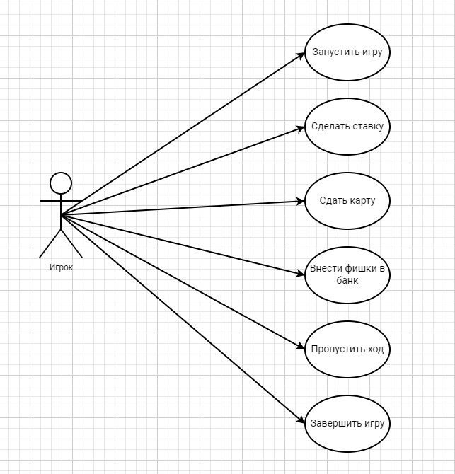

# Лабораторая работа №1
___
__Проект 13. Яблон (В промежутке, Туз-двойка)__

Диаграмма вариантов использования (use-case)

___
## Прецедент "Запустить игру"
Описание: Игрок указывает количество ботов (от 1 до 7)
* Основоной исполнитель: Игрок
* Предусловие: Приложение запущено, количество ботов еще не известно
* Постусловие: Начинается игра, количество ботов известно, игроку зачисленно определенная сумма фишек
### Основной успешный сценарий
Пользователь | Система
:-----------------------|-----------------------:
1\. Нажимает на кнопку "Начать игру" |
|| 2\. Запрашивает у игрока ввод количества ботов
3\. Вводит количество ботов от 1 до 7 | 
|| 4\. Проверяет корректность данных
|| 5\. Запускает игровой процесс

### Альтернативный сценарий
Игрок не заполнил или заполнил некорректно поле для ввода количества ботов, тогда система сообщит об ошибке и даст возможность заполнить поле заново.

## Прецедент "Сделать ставку"
Описание: До игрока дошла очередь в круге. Он решает сделать ставку
* Основоной исполнитель: Игрок
* Предусловие: До игрока дошла очередь в круге
* Постусловие: Дальшейшие события происходят согласно правилам игры

### Основной успешный сценарий
Пользователь | Система
:-----------------------|-----------------------:
1\.  Делает ставку  |
|| 2\. Сдаёт карту
|| 3\. Сравнивает карты игрока и сданную карту и делает вывод, что игрок выйграл
|| 4\. Выдаёт игроку из банка удвоенную сумму фишек заданную в начале игры

### Альтернативный сценарий 1
Если игрок сделал ставку, но не выйграл, то он не получает фишки из банка

### Альтернативный сценарий 2
Если игрок в тот момент, когда делает ставку, сам является сдающем, то он должен сам себе сдать карту. Если игрок выйграл, то получает удвоенную сумму фишек заданную в начале игры

### Альтернативный сценарий 3
Если игрок в тот момент, когда делает ставку, сам является сдающем, то он должен сам себе сдать карту. Если игрок проиграл, то не получает фишек из банка

## Прецедент "Сдать карту"
Описание: Если игрок является сдающим, то он должен выдать третью карту игроку, который решил сделать ставку.
* Основоной исполнитель: Игрок
* Предусловие: Игрок, до которого дошла очередь в кругу, решил сделать ставку
* Постусловие: Игрок, до которого дошла очередь в кругу, увидел третью карту
### Основной успешный сценарий
Пользователь | Система
:-----------------------|-----------------------:
1\. Нажимает на кнопку "Сдать карту" | 
|| 2\. Сдаёт карту из колоды

## Прецедент "Внести фишки в банк"
Описание: В начале новой игры, игрок должен ввести количество фишек, которые он внесет в банк. Такую же сумму внесут в банк боты.
* Основоной исполнитель: Игрок
* Предусловие: Игрок запустил игру и указал количество ботов
* Постусловие: Начинается первый раунд

### Основной успешный сценарий
Пользователь | Система
:-----------------------|-----------------------:
|| 1\. Запрашивает у игрока ввод суммы фишек
2\. Вводит определенную сумму фишек  |
|| 3\. Проверяет введенные данные на корректность
|| 4\. Запускаяет первый раунд

### Альтернативный сценарий
Игрок не заполнил или заполнил некорректно поле для ввода количества фишек, тогда система сообщит об ошибке и даст возможность заполнить поле заново.

## Прецедент "Пропустить ход"
Описание: До игрока дошла очередь в круге. Он решает не делать ставку
* Основоной исполнитель: Игрок
* Предусловие: До игрока дошла очередь в круге
* Постусловие: Игрок не получает фишек из банка, ход переходит к следующему игроку или начинается новый раунд, если игрок был последний в круге

### Основной успешный сценарий
Пользователь | Система
:-----------------------|-----------------------:
1\.  Нажимет на кнопку "Пропустить ход"  |
|| 2\. Передаёт ход следующему игроку

### Альтернативный сценарий 1
Если игрок, который пропустил ход является последним в кругу, то начинается следующий раунд

## Прецедент "Завершить игру"
Описание: Игрок может в любой момент завершить игру
* Основоной исполнитель: Игрок
* Предусловие: Игра начата
* Постусловие: Состояние системы возвращено в первоначальный вид к моменту ввода количества ботов и начальной суммы, вносимой в банк

### Основной успешный сценарий
Пользователь | Система
:-----------------------|-----------------------:
1\. Нажимает на кнопку "Завершить игру"  | 
|| 2\. Возвращает состояние игры в первоначальное
