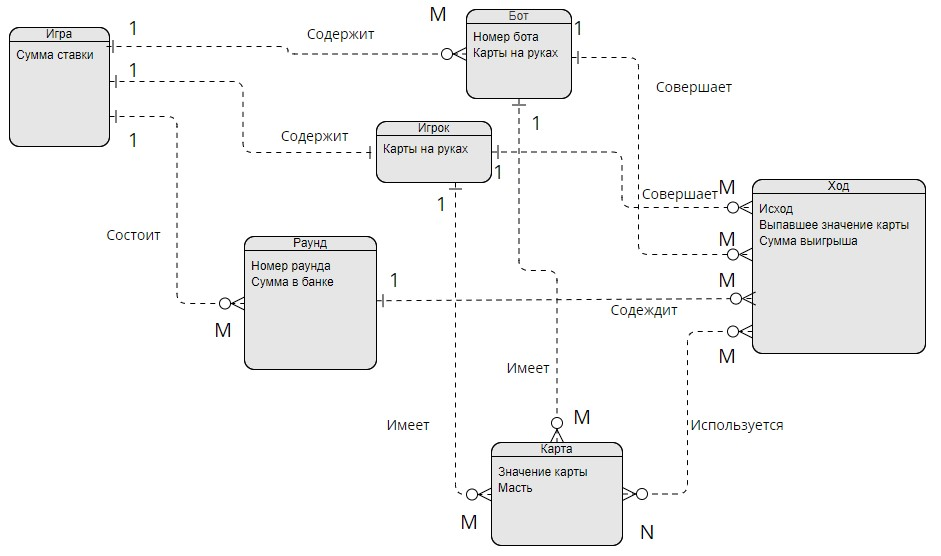

# Лабораторая работа №2
___

ERD diagram

___
## Сущности
### Игра
сущность Игра - среда, в которой происходит игровой процесс
#### Свойства:
* Сумма ставки - количество фишек, которые кладут в банк игрок и боты в начале каждого раунда

### Игрок
Сущность Игрок - означает реального (живого) пользователя, который принимает участие в игровом процессе
#### Свойства:
* Карты на руках - 2 карты, которые выдаются игроку в каждом раунде

### Бот
Сущность Бот - означает искусственного игрока, который принимает участие в игровом процессе по заданному алгоритму
#### Свойства:
* Номер бота
* Карты на руках - 2 карты, которые выдаются игроку в каждом раунде

### Раунд
Сущность Раунд - означает игровой цикл, в процессе которого каджый игрок совершает свой ход. В начале каждого раунда игроки вносят заданную сумму в банк
#### Свойства:
* Номер раунда
* Сумма в банке

### Ход
Сущность Ход - означает процесс хода каждого игрока во время раунда
#### Свойства:
* Исход - результат хода
* Выпавшее значение карты
* Сумма выйгрыша (если проигрыш, то сумма выйгрыша = 0)

### Карта
Сущность Карта - означает игровую карту определенного значения и масти
#### Свойства:
* Значение карты
* Масть

## Связи

### Игра - Игрок
В одной игре может быть только один Игрок, один Игрок может содержаться только в одной Игре

### Игра - Бот
В одной игре может быть много Ботов, один Бот может содержаться только в одной Игре

### Игра - Раунд
Одна Игра состоит из одного или более Раундов, один Раунд может быть только в одной Игре

### Игрок - Ход
Игрок может совершить один или более Ходов, один Ход всегда относится к одному Игроку

### Бот - Ход
Бот может совержить один или более Ходов, один Ход всегда относится к одному Игроку

### Раунд - Ход
Во время раунда происходит один или более Ходов, один Ход всегда содержится в одном Раунде

### Карта - Игрок
Игрок имеет 2 Карты в каждом раунде, одна Карта может быть только у одного Игрока

### Карта - Бот
Бот имеет 2 Карты в каждом раунде, одна Карта может быть только у одного Бота

### Карта - Ход
На каждом Ходу может использоваться несколько Карт, одна Карта может быть использована в разных Ходах