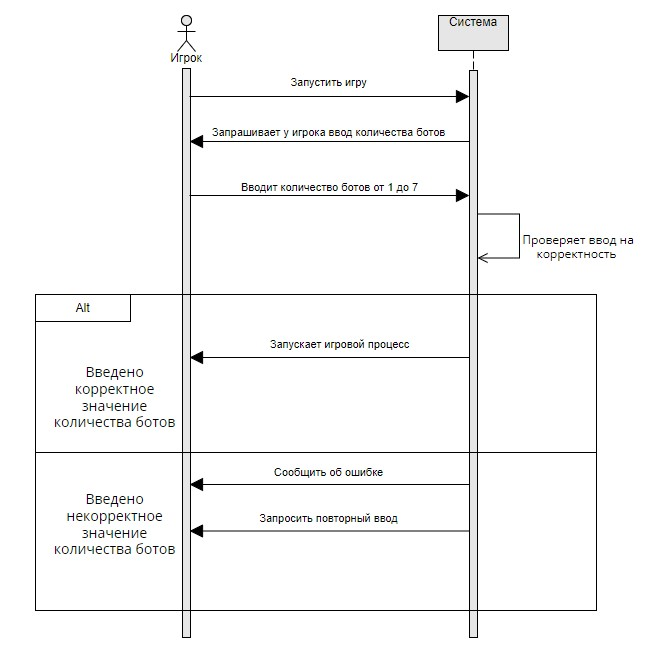
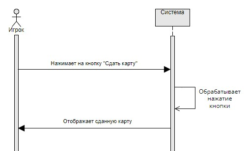
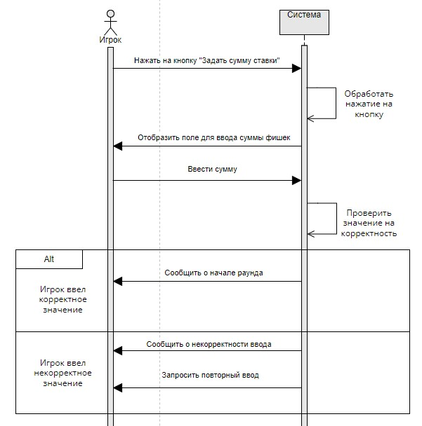

# Лабораторая работа №3 
# Создание системных диаграмм последовательностей
___

## Прецедент "Запустить игру"

Операция | Запустить игру
:-----------------------|-----------------------:
Ссылки | Прецеденты: Запуск игры
Предусловия | Пользователь решил запустить игру
Постусловия | Приложение запущено

Операция | Запрашивает у игрока ввод количества ботов
:-----------------------|-----------------------:
Ссылки | Прецеденты: Запуск игры
Предусловия | Приложение запущено
Постусловия | Выводится поле для ввода количесотва ботов

Операция | Вводит количество ботов от 1 до 7
:-----------------------|-----------------------:
Ссылки | Прецеденты: Запуск игры
Предусловия | Игроку вывелось поле для ввода
Постусловия | Игрок отправил введенные данные

Операция | Проверяет ввод на корректность
:-----------------------|-----------------------:
Ссылки | Прецеденты: Запуск игры
Предусловия | Игрок ввел количество ботов в отобразившееся поле
Постусловия | Система имеет результат проверки на корректность

Операция | Запускает игровой процесс
:-----------------------|-----------------------:
Ссылки | Прецеденты: Запуск игры
Предусловия | Игрок корректно ввел данные о количестве ботов
Постусловия | Начинается первый раунд игры

Операция | Сообщить об ошибке
:-----------------------|-----------------------:
Ссылки | Прецеденты: Запуск игры
Предусловия | Игрок некорректно ввел данные о количестве ботов
Постусловия | Игрок получил сообщение о некорректности введенных данных

Операция | Запросить повторный ввод
:-----------------------|-----------------------:
Ссылки | Прецеденты: Запуск игры
Предусловия | Игрок некорректно ввел данные и получил сообщение об этом
Постусловия | Отображается поле для повтороного ввода данных
___

## Прецедент "Сделать ставку"

Операция | Нажимает на кнопку "Сделать ставку"
:-----------------------|-----------------------:
Ссылки | Прецеденты: Сделать ставку
Предусловия | Игроку отобразилась кнопка "Сделать ставку"
Постусловия | Игрок нажимает на кнопку "Сделать ставку"

Операция | Обрабатывает нажатие кнопки
:-----------------------|-----------------------:
Ссылки | Прецеденты: Сделать ставку
Предусловия | Игрок нажал на кнопку "Сделать ставку"
Постусловия | Система обработала нажатие кнопки

Операция | Сдать карту
:-----------------------|-----------------------:
Ссылки | Прецеденты: Сделать ставку
Предусловия | Игрок нажал на кнопку "Сделать ставку" и система обработала нажатие
Постусловия | Система сдаёт карту игроку

Операция | Вычислить результат ставки
:-----------------------|-----------------------:
Ссылки | Прецеденты: Сделать ставку
Предусловия | Система сдала карту игроку
Постусловия | Система вычислила результат ставки

Операция | Выдать из банка сумму выйгрыша (0 - если пройгрыш)
:-----------------------|-----------------------:
Ссылки | Прецеденты: Сделать ставку
Предусловия | Система вычислила результат ставки
Постусловия | Сумма зачислена на счет игрока
___

## Прецедент "Сдать карту"

Операция | Нажимает на кнопку "Сдать карту"
:-----------------------|-----------------------:
Ссылки | Прецеденты: Сдать карту
Предусловия | Отобразилась кнопка "Сдать карту"
Постусловия | Игрок нажал на кнопку "Сдать карту"

Операция | Обрабатывает нажатие кнопки
:-----------------------|-----------------------:
Ссылки | Прецеденты: Сдать карту
Предусловия | Игрок нажал на кнопку "Сдать карту"
Постусловия | Система высчитала какую карту сдавать

Операция | Отображает сданную карту
:-----------------------|-----------------------:
Ссылки | Прецеденты: Сдать карту
Предусловия | Система высчитала какую карту сдавать
Постусловия | Система отобразила сданную карту
___

## Прецедент "Внести фишки в банк"

Операция | Нажать на кнопку "Задать сумму ставки"
:-----------------------|-----------------------:
Ссылки | Прецеденты: Внести фишки в банк
Предусловия | Оборажена кнопка "Задать сумму ставки"
Постусловия | Игрок нажал на кнопку "Задать сумму ставки"

Операция | Обработать нажатие на кнопку
:-----------------------|-----------------------:
Ссылки | Прецеденты: Внести фишки в банк
Предусловия | Игрок нажал на кнопку "Задать сумму ставки"
Постусловия | Система считала нажатие на кнопку "Задать сумму ставки"

Операция | Отобразить поле для ввода суммы фишек
:-----------------------|-----------------------:
Ссылки | Прецеденты: Внести фишки в банк
Предусловия | Игрок нажал на кнопку "Задать сумму ставки" и система считала нажатие
Постусловия | Отобразилось поле для ввода суммы фишек

Операция | Ввести сумму
:-----------------------|-----------------------:
Ссылки | Прецеденты: Внести фишки в банк
Предусловия | Отобразилось поле для ввода суммы фишек
Постусловия | Игрок вводит сумму фишек

Операция | Проверить значения на корректность
:-----------------------|-----------------------:
Ссылки | Прецеденты: Внести фишки в банк
Предусловия | Игрок ввел сумму фишек
Постусловия | Система имеет результат проверки на корректность

Операция | Сообщить о начале раунда
:-----------------------|-----------------------:
Ссылки | Прецеденты: Внести фишки в банк
Предусловия | Введенное значение корректно
Постусловия | Игрок видит сообщение о начале раунда

Операция | Сообщить о некорректности ввода
:-----------------------|-----------------------:
Ссылки | Прецеденты: Внести фишки в банк
Предусловия | Введенное значение некорректное
Постусловия | Игрок видит сообщение об ошибке

Операция | Запросить повторный ввод
:-----------------------|-----------------------:
Ссылки | Прецеденты: Внести фишки в банк
Предусловия | Введенное значение некорректное и игрок получил сообщение об ошибке
Постусловия | Отображается поле для повторного ввода
___

## Прецедент "Пропустить ход"

Операция | Нажать на кнопку "Пропустить ход"
:-----------------------|-----------------------:
Ссылки | Прецеденты: Пропустить ход
Предусловия | Отобразилась кнопка "Пропустить ход"
Постусловия | Игрок нажал на кнопку "Пропустить ход"

Операция | Обработать нажатие кнопки
:-----------------------|-----------------------:
Ссылки | Прецеденты: Пропустить ход
Предусловия | Игрок нажал на кнопку "Пропустить ход"
Постусловия | Система считала нажатие на кнопку

Операция | Передать ход следующему игроку
:-----------------------|-----------------------:
Ссылки | Прецеденты: Пропустить ход
Предусловия | Система считала нажатие на кнопку
Постусловия | Ход переходит следующему игроку
___

## Прецедент "Завершить игру"

Операция | Нажимает на кнопку "Завершить игру"
:-----------------------|-----------------------:
Ссылки | Прецеденты: Завершить игру
Предусловия | Отображена кнопка "Завершить игру"
Постусловия | Игрок нажал на кнопку

Операция | Обработать нажатие на кнопку
:-----------------------|-----------------------:
Ссылки | Прецеденты: Завершить игру
Предусловия | Игрок нажал на кнопку "Завершить игру"
Постусловия | Система считала нажатие на кнопку

Операция | Возвратить игру к первоначальному состоянию
:-----------------------|-----------------------:
Ссылки | Прецеденты: Завершить игру
Предусловия | Игрок нажал на кнопку "Завершить игру" и система считала нажатие
Постусловия | Система возвращает программу к изначальному состоянию