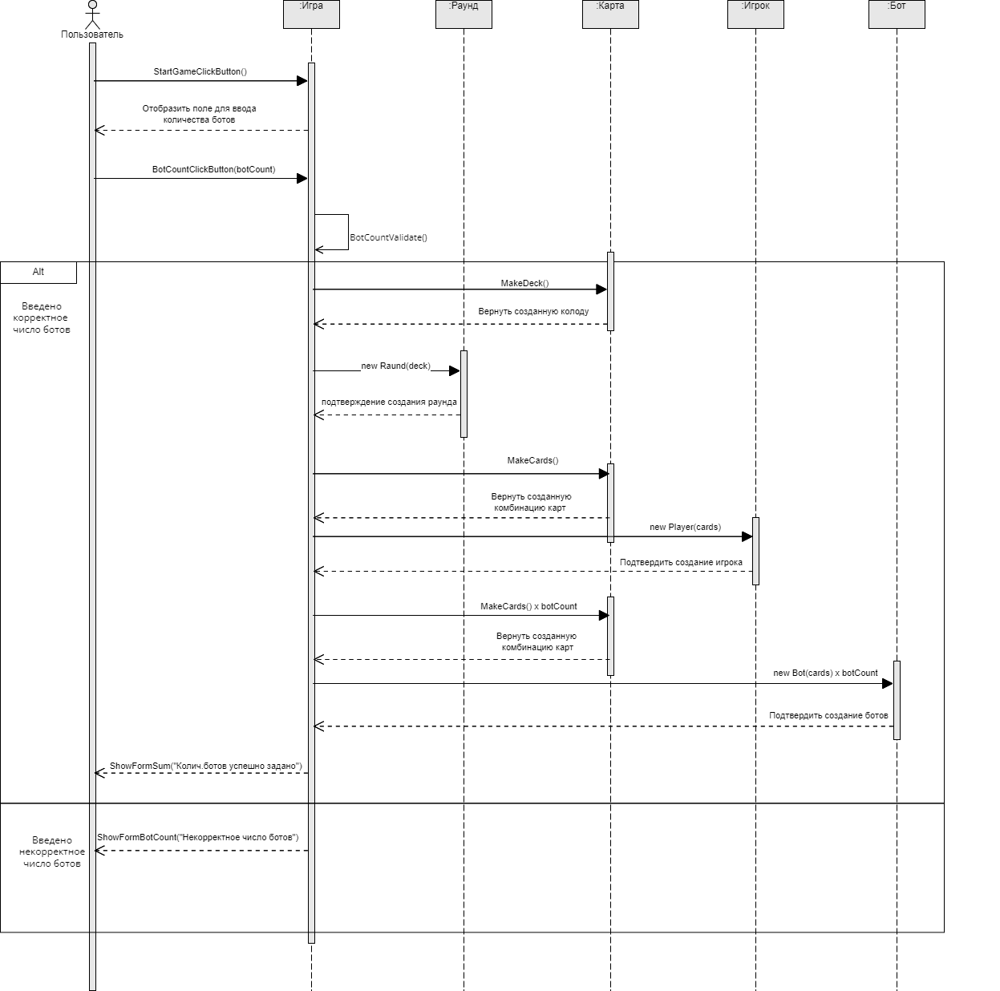
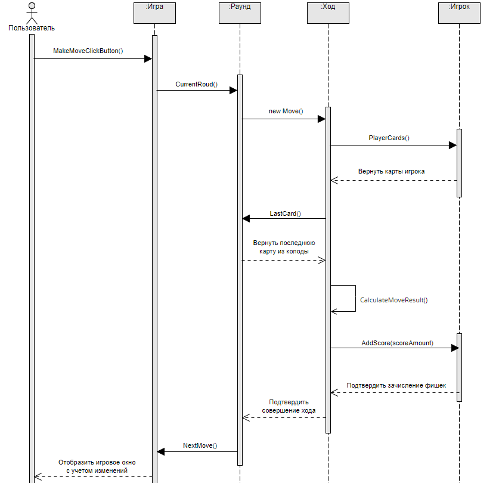
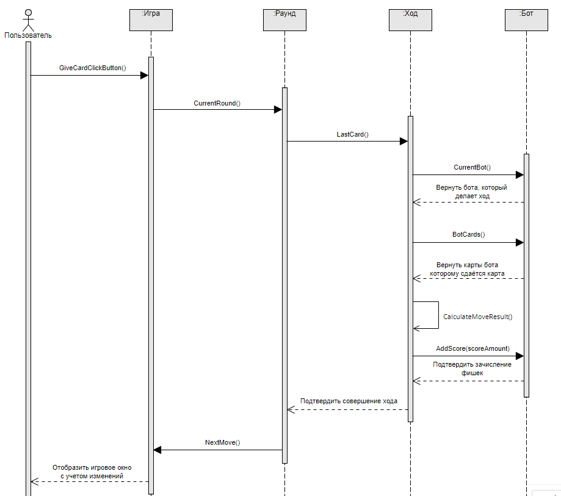
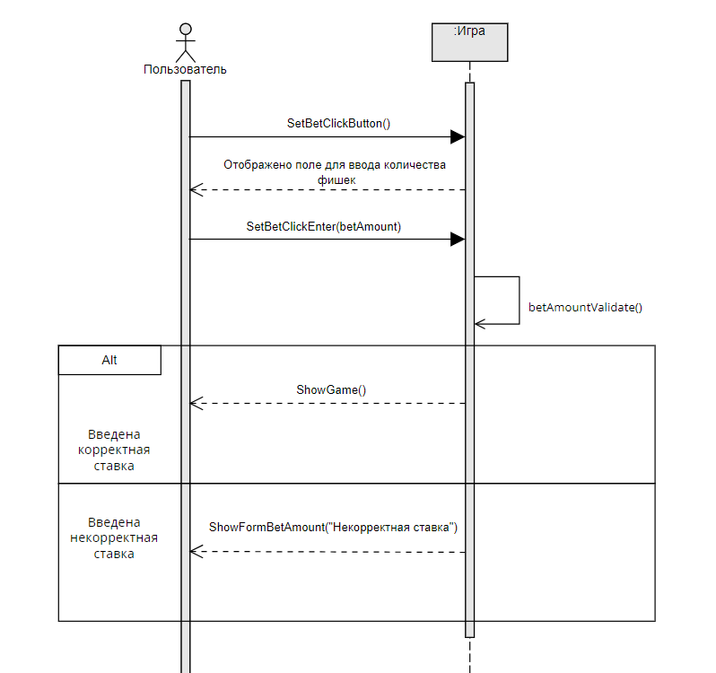
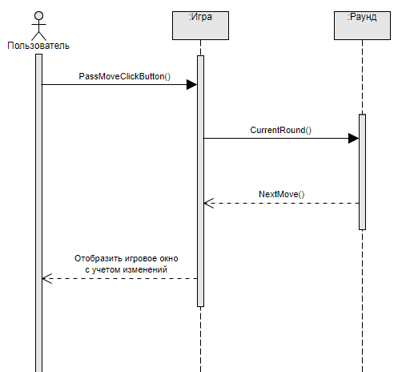
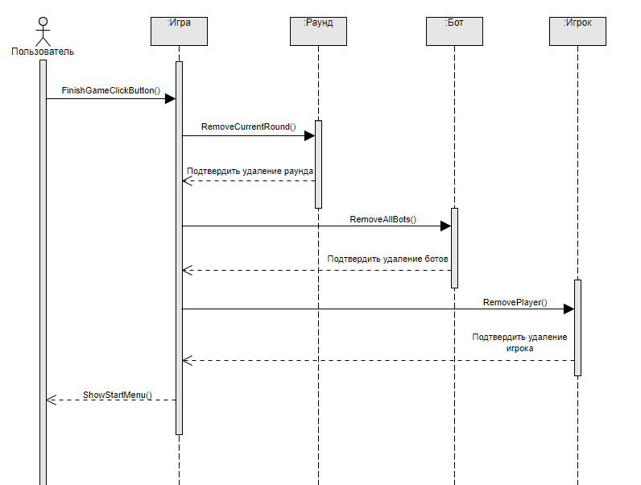

# Лабораторная работа №4: Создание диаграмм взаимодействия
___

## Описание классов
Игрок (Player) - Представляет участника игры. Игра (Game) - Представляет игровую сессию. Раунд (Round) - Представляет один раунд в рамках игры. Ход (Move) - Представляет один ход игрока в рамках раунда. Бот (Bot) - Представляет игрока, управляемого системой. Карта (Card) - Представляет игральную карту.

## Диаграмма взаимодействия для системной функции "Запустить игру"

Операция | Предусловие | Постусловие
:-----------------------|-----------------------|---------------------:
StartGameClickButton() | Приложение запущено, отображена кнопка "Начать игру" | Отображается поле для ввода количества ботов
BotCountClickButton(botCount) | Отображено поле для ввода количества ботов  | Пользователь ввел количетсво ботов
BotCountValidate() | Пользователь ввел количетсво ботов | Система вычислила, правильно ли пользователь ввел количество ботов
MakeDeck() | Пользователь корректно ввел количество ботов | Создана "перетасованная" колода
new Round(deck) | Пользователь корректно ввел количество ботов, создана колода | Создан объект Раунда с новой колодой
MakeCards() | Создан объект Раунда | Создана случайная комбинация из двух карт
new Player(cards) | Создана случайная комбинация из двух карт | Создан объект Игрока со случайной комбинацией из двух карт
new Bot(cards) | Созданы случайные комбинации из двух карт для заданного количества ботов | Создано заданное количество объектов Ботов со случайными комбинациями карт
ShowFormSum("Колич.ботов успешно задано") | Созданы или получены от пользователи все необходимые данные для начала игры | Отобразить поле количества фишек в банке
ShowFormCount("Некорректное число ботов") | Пользователь некорректно ввел количество ботов | Отобразить поле для ввода количества ботов и уведомление об ошибке
___
## Диаграмма взаимодействия для системной функции "Сделать ставку"

Операция | Предусловие | Постусловие
:-----------------------|-----------------------|---------------------:
MakeMoveClickButton() | Отображена кнопка "сделать ход" | Система начинает выполнять код хода игрока
CurrentRound() | Пользователь нажал на кнопку "сделать ход" | Система определяем текущий объект Раунда
new Move() | Система определила текущий объект раунда | Создан объект Хода
PlayerCards() | Создан объект хода | Система получила данные о текущих картах игрока
LastCard() | Создан объект хода, система получила данные о текущих картах игрока | Система получила данные о последней карте из колоды
CalculateMoveResult() | Получены все необходимые данные, чтобы вычислить результат хода | Вычислен результат хода
AddScore(scoreAmount) | Вычислен результат хода | Добавление игроку количества выйгранных фишек (0 - если пройгрыш)
NextMove() | Игроку начислены фишки | Переход хода к следующему игроку (Боту)
___
## Диаграмма взаимодействия для системной функции "Сдать карту"

Операция | Предусловие | Постусловие
:-----------------------|-----------------------|---------------------:
GiveCardClickButton() | Отображена кнопка "Сдать карту" | Система начинает выполнять код сдавания карты
CurrentRound() | Пользователь нажал на кнопку "Сдать карту" | Система определяет текущий объект Раунда
LastCard() | Система определила текущий объект раунда | Система определила последнюю карту в колоде
CurrentBot() | Система определила последнюю карту в колоде | Система определила текущего Бота, который делает ход
BotCards() | Система определила текущего Бота, который делает ход | Система определила комбинацию карт у текущего Бота
CalculateMoveResult() | Система получила все необходимые данные, чтобы вычислить результат хода | Система вычислила результат хода
AddScore(scoreAmount) | Система вычислила результат хода | Боту начисляются количество выйгранных фишек (0 - если пройгрышь)
NextMove() | Боту начислены фишки | Переход хода к следующему игроку
___
## Диаграмма взаимодействия для системной функции "Внести фишки в банк"

Операция | Предусловие | Постусловие
:-----------------------|-----------------------|---------------------:
SetBetClickButton() | Отображена кнопка "Задать сумму фишек" | Отображено поле для ввода суммы фишек
SetBetClickEnter(betAmount) | Отображено поле для ввода суммы фишек | Пользователь ввел сумму фишек
betAmountValidate() | Пользователь ввел сумму фишек | Система вычислила, корректен ли ввод суммы фишек
showGame() | Сумма фишек введена корректно | Отобразить на экране игровое поле
ShowFormBetAmount("Некорректная ставка") | Сумма фишек введена некорректно | Отображено поле для ввода количества фишек, отображено сообщение об ошибке
___
## Диаграмма взаимодействия для системной функции "Пропустить ход"

Операция | Предусловие | Постусловие
:-----------------------|-----------------------|---------------------:
PassMoveClickButton() | Отображена кнопка "Пропустить ход" | Система начинает выполнять код пропуска хода
CurrentRound() | Пользователь нажал на кнопку "Пропустить ход" | Система определила объект текущего Раунда
NextMove() | Система определила объект текущего Раунда | Ход переходит следующему игроку, отображается игровое поле с учетом изменений
___
## Диаграмма взаимодействия для системной функции "Завершить игру"

Операция | Предусловие | Постусловие
:-----------------------|-----------------------|---------------------:
FinishGameClickButton() | Отображена кнопка "Завершить игру" | Начинается выполнение кода по завершению игрового процесса
RemoveCurrentRound() | Пользователь нажал на кнопку "Завершить игру" | Удаляется объект текущего Раунда
RemoveAllBots() | Удален объект текущего Раунда | Удаляются все объекты Ботов
RemovePlayer() | Удалены все объекты Ботов | Удаляется объект Игрока
ShowStartMenu() | Удален объект Игрока | Отображено начальное меню, отображена кнопка "Начать игру"

