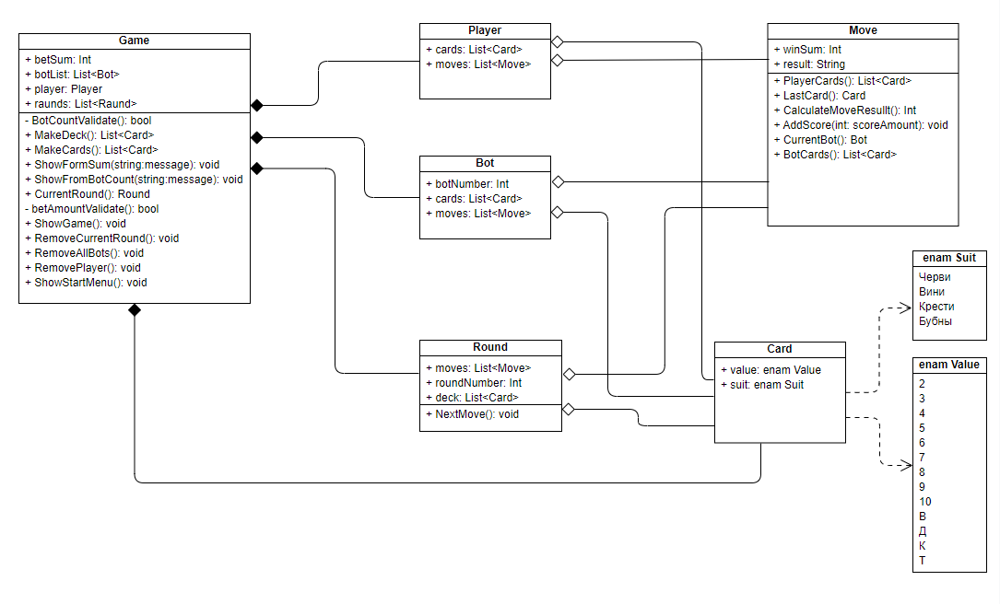

# Лабораторная работа №5: Создание диаграммы классов. Игра "Яблон"
___

## Диаграмма классов

Игрок (Player) - Представляет участника игры. Игра (Game) - Представляет игровую сессию. Раунд (Round) - Представляет один раунд в рамках игры. Ход (Move) - Представляет один ход игрока в рамках раунда. Бот (Bot) - Представляет игрока, управляемого системой. Карта (Card) - Представляет игральную карту.

### Класс Game
Описание: Описывает основные процессы Игры

### Класс Player
Описание: Описывает Игрока, хранит информацию о нем

### Класс Bot
Описание: Описывает Бота, хранит информацию о нем

### Класс Round
Описание: Хранит данные о конкретном раунде и описывает его процессы

### Класс Move
Описание: Хранит данные о конкретном ходе игрока или бота и описывает процессы хода

### Класс Card
Описание: Описывает Карту, которая состоит из масти и занчения
___

## Отношения между классами
1. Game и Player
    * Отношение: Композиция
    * Описание: Игроки не могут существовать независимо от игры
2. Game и Bot
    * Отношение: Композиция
    * Описание: Боты не могут существовать независимо от игры
3. Game и Round
    * Отношение: Композиция
    * Описание: Раунд не может существовать независимо от игры
4. Move и Player
    * Отношение: Агрегация
    * Описание: Ход может существовать независимо от Игрока, так как может быть связан с другими классами
5. Move и Bot
    * Отношение: Агрегация
    * Описание: Ход может существовать независимо от Бота, так как может быть связан с другими классами
6. Move и Raund
    * Отношение: Агрегация
    * Описание: Ход может существовать независимо от Раунда, так как может быть связан с другими классами
7. Card и Player
    * Отношение: Агрегация
    * Описание: Карта может существовать без Игрока, так как может быть связана с другим классом
8. Card и Bot
    * Отношение: Агрегация
    * Описание: Карта может существовать без Бота, так как может быть связана с другим классом
9. Card и Round
    * Отношение: Агрегация
    * Описание: Карта может существовать без Раунда, так как может быть связана с другим классом
10. Card и enam Suit
    * Отношение: Зависимость
    * Описание: Card зависит от Suit, поскольку использует Suit как тип для одного из своих свойств
11. Card и enam Value
    * Отношение: Зависимость
    * Описание: Card зависит от Value, поскольку использует Value как тип для одного из своих свойств

